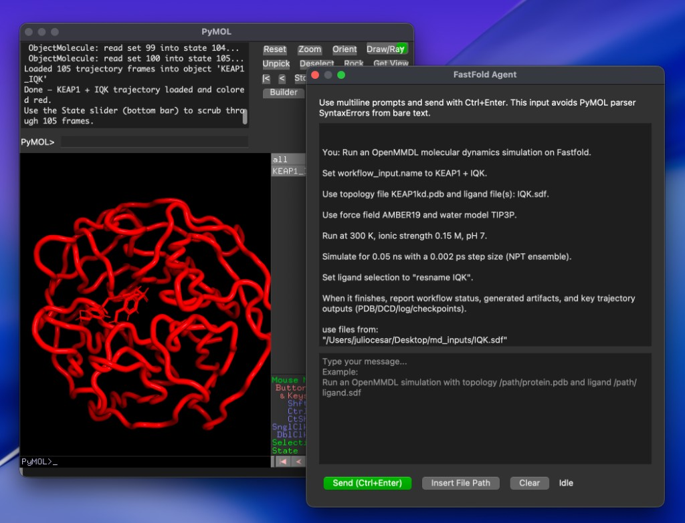

# Fastfold PyMOL Agent

Fastfold PyMOL Agent is a PyMOL plugin for biology workflows: run Fastfold skills, bring generated artifacts into PyMOL, and keep iterating with natural-language visualization and analysis.



- Skill-first workflows: discover and run installed Fastfold skills from chat, then immediately load generated structures and artifacts into PyMOL.
- PyMOL-native agent UX: multiline chat UI, local file references, streaming responses, and iterative structure edits without leaving PyMOL.
- Built for reusable skills: add skills as folders and use the same interface for fold jobs, MD workflows, and custom script-backed automations.
- Official skills pack: [fastfold-ai/skills/tree/main/skills](https://github.com/fastfold-ai/skills/tree/main/skills)

---

## Quick Install

Install the Fastfold agent and PyMOL open source with our standalone installers 

```bash
curl -LsSf http://fastfold.ai/pymol-agent/install.sh | sh
```

> Note: when PyMOL Open Source is not already installed, this step can take around 5 minutes.

Install agent only (skip PyMOL install):

```bash
curl -LsSf http://fastfold.ai/pymol-agent/install.sh | sh -s -- --agent-only
```

Override conda env name:

```bash
curl -LsSf http://fastfold.ai/pymol-agent/install.sh | sh -s -- --env-name myenv
```

Then launch PyMOL:

```bash
conda activate myenv
pymol
```

This opens the PyMOL UI. Then follow the **First run in PyMOL** section below to configure API keys and launch the agent UI.

```text
fastfold help
```

### Upgrade an existing install

If you already installed the plugin and want the latest version from GitHub, run this inside PyMOL:

```text
fastfold upgrade
```

Then restart PyMOL to load the updated plugin.

---

## First run in PyMOL

Configure keys and start the agent:

```text
fastfold doctor
fastfold setup anthropic <your-anthropic-api-key>
fastfold setup fastfold <your-fastfold-api-key>
fastfold ui
```

Where to get keys:

- Fastfold API key: [https://cloud.fastfold.ai/api-keys](https://cloud.fastfold.ai/api-keys)
- Anthropic API key: [https://platform.claude.com/dashboard](https://platform.claude.com/dashboard)

### Model selection

Fastfold PyMOL Agent defaults to `claude-haiku-4-5` (fastest profile from the Anthropic model lineup).

To change the base Anthropic model:

```text
fastfold config set anthropic_model <model-name>
```

Model validation is enforced: only model IDs/aliases from Anthropic's models overview are accepted.

Recommended model options:

| Feature | Claude Opus 4.7 | Claude Sonnet 4.6 | Claude Haiku 4.5 |
| --- | --- | --- | --- |
| Claude API alias | `claude-opus-4-7` | `claude-sonnet-4-6` | `claude-haiku-4-5` |
| Extended thinking | No | Yes | Yes |
| Adaptive thinking | Yes | Yes | No |
| Comparative latency | Moderate | Fast | Fastest |

Examples:

```text
fastfold config set anthropic_model claude-haiku-4-5
fastfold config set anthropic_model claude-sonnet-4-6
```

Check current settings anytime:

```text
fastfold config show
```

---

## Chat UI workflow (recommended)

Use the chat window for long prompts, local file paths, and multi-step workflows:

```text
fastfold ui
```

### Combining Fastfold skills + PyMOL edits

Use one request that asks the agent to run a skill workflow and then style/analyze results in PyMOL.

All submitted jobs are visible in your Fastfold dashboard: [https://cloud.fastfold.ai/jobs](https://cloud.fastfold.ai/jobs).

Simple prompt example:

```text
Use esm1b in Fastfold to run a fold job.

Use these sequences:
Sequence 1 (protein): MGLSDGEWQLVLNVWGKVEADIPGHGQEVLIRLFKGHPETLERFDKFKHLKSEDEMKASEDLKKHGATVLTALGGILKKKGHHEAEIKPLAQSHATKHKIPVKYLEFISECIIQVLQSKHPGDFGADAQRAMNKALELFRKDMASNYKELGFQG and show the prediction as cartoon colored by secondary structure.
```

Example (fold -> CIF -> PyMOL):

```text
Use the fold skill to submit an esm1b job for this sequence, wait for completion, download the CIF, load it into PyMOL as "esm1b_result", then color by pLDDT and label low-confidence loops.
```

Example (MD workflow -> frames/artifacts -> PyMOL):

```text
Use md-openmmdl to run a short workflow from my topology and ligand files, fetch artifacts, load representative structures in PyMOL, then compare start vs end conformations with cartoons and sticks at the binding site.
```

Example (artifact refinement loop):

```text
From the latest Fastfold artifact, load structure(s), create publication-style scenes for chain interfaces, and export both a PNG and a PyMOL session file.
```

### Referencing local files in chat

- Use the **Insert File Path** button in the UI to inject absolute paths.
- You can also paste paths manually; keep paths quoted if they contain spaces.
- Ask explicitly what to do with each file (load, align, style, measure, export).

Examples:

```text
Load "/Users/you/data/model.cif" as object "pred_cif", show cartoon, color by chain, and center view.
```

```text
Load "/Users/you/data/model.pdb" as "ref_pdb", align it to "pred_cif", then highlight residues 45-70 as sticks.
```

```text
Load topology "/Users/you/data/protein.pdb" as "traj_top", load trajectory "/Users/you/data/run.dcd", then show RMSD over time and display frame 1 and last frame as cartoons.
```

### PDB, CIF, and trajectory editing patterns

After files are loaded, ask for concrete modifications:

```text
PDB: show cartoon, color by chain, show ligand as sticks, and add hydrogen-bond distances.
CIF: map confidence to spectrum colors, select residues with confidence < 70, and make them transparent surface.
Trajectory: align all frames to chain A, compute RMSD, and generate snapshots for frames 1/50/100.
```

Tip: give object names in your prompt (`as "obj_name"`) so follow-up instructions are consistent.

---

## Commands

### Core

```text
fastfold <prompt>                     ask the agent and auto-execute
fastfold dry <prompt>                 preview generated commands
fastfold save [file.py] <prompt>      run prompt and save script
fastfold save [file.py]               save last generated script
fastfold undo                         restore scene before last command
fastfold reset                        clear conversation and undo state
ff <...>                              short alias for fastfold
```

### Agent mode and GUI

```text
agent <message>                       conversational alias
fastfold agent on|off|status          toggle/show agent mode
fastfold ui                           open multiline Fastfold Agent window
```

### Setup and config

```text
fastfold setup
fastfold setup <anthropic> <fastfold>
fastfold setup anthropic <key>
fastfold setup fastfold <key>
fastfold upgrade
fastfold doctor

fastfold config show
fastfold config set <key> <value>
fastfold config set anthropic_model <model-name>
```

### Skills and logs

```text
fastfold skills list
fastfold skills show <name>
fastfold skills howto <name>
fastfold skills search <query>
fastfold skills reload

fastfold log show
fastfold log save [file.py]
fastfold log export [file.json]
```

---

## Skills (drop-in folders)

Default config file:

```text
~/.fastfold-pymol-agent.json
```

Default skills path:

```text
~/.fastfold-pymol-agent/skills
```

Minimum skill layout:

```text
~/.fastfold-pymol-agent/skills/my-skill/SKILL.md
```

Optional:

- `scripts/` for helper executables
- `references/` for docs/schemas
- `skill.json` for metadata

After adding/editing skills:

```text
fastfold skills reload
```

---

## Inspired by

- [KodyKlupt/PromptMOL](https://github.com/KodyKlupt/PromptMOL)
- [colbyford/PyMOLfold](https://github.com/colbyford/PyMOLfold)
